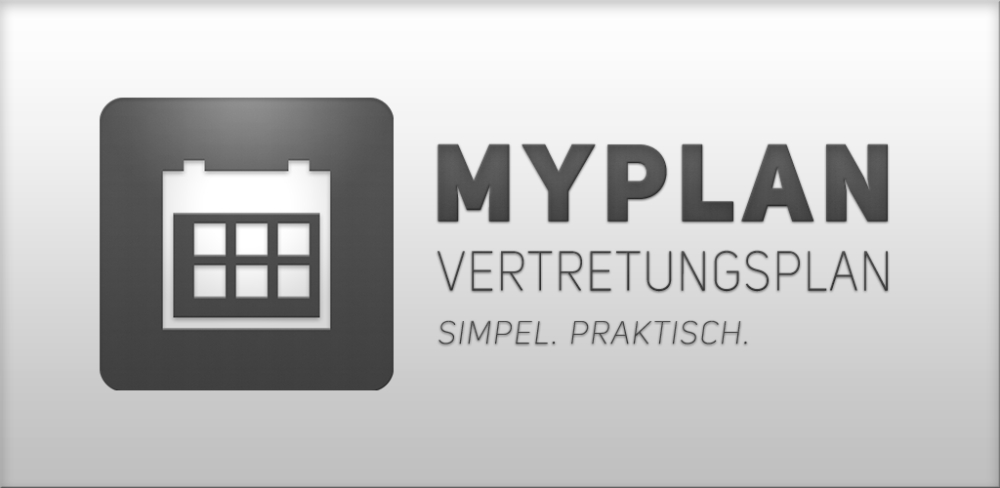

# myPlan
> Vertretungsplan App mit praktischen Zusatzfunktionen.

#### Alle Features im Überblick:

* Klassen-/Stufenfilter

* Push Benachrichtigungen

* Offline-Funktion

* Helles und dunkles Farbschema

* Kurze und schnelle Ladezeiten

* Einfaches und übersichtliches Design

## Installation

Android Google Play Store:

> https://play.google.com/store/apps/details?id=de.myplan.android

Alternativ Download des letzes Release als `.apk`.
>  https://github.com/jrheiner/myplan/releases/latest

## Autor

Jonas Rheiner – [@jrheiner](https://github.com/jrheiner)

[Lizenzinformationen](https://github.com/jrheiner/myplan/blob/master/LICENSE)

 
> Danke an [@daniel-lerch](https://github.com/daniel-lerch)
